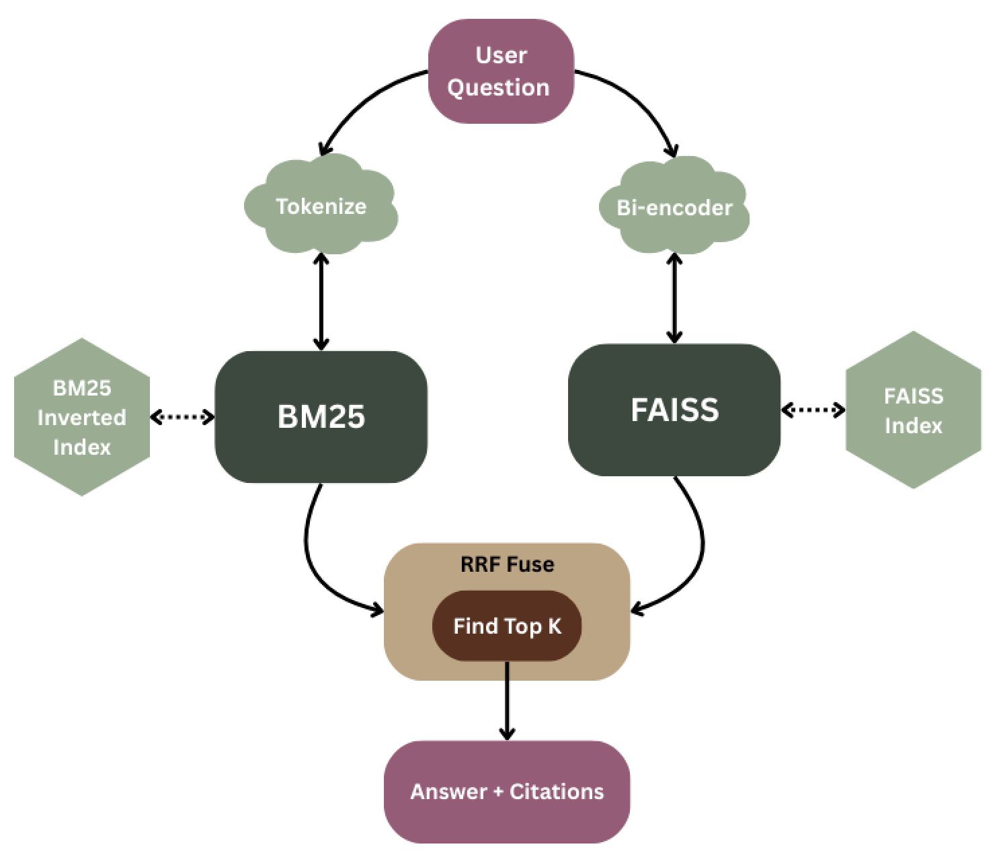

# RAG Simple (Baseline)


A tiny, readable baseline for **Retrieval-Augmented Generation (RAG)**. 
This RAG framework provides **Hybrid** (RRF-fused) retrieval to combine **BM25** (sparse/lexical) and **Sentence-Transformers + FAISS** (dense/semantic). The generator is flexible, we can swap for any LLM.

---

## Project structure

```
rag-simple/
├── README.md
├── requirements.txt
├── .gitignore
├── data/
│   └── docs/                 # put your reference
│       ├── doc1.txt
│       ├── doc2.txt
│       └── doc3.txt
├── main.py                   
└── raglib/
    ├── __init__.py
    ├── ingest.py            
    ├── bm25.py              
    ├── dense.py              
    ├── hybrid.py             
    └── generate.py
```

---

## 1) Setup

```bash
cd rag-simple
python -m venv .venv
source .venv/bin/activate
pip install -U pip
pip install -r requirements.txt
```
---

## 2) Quickstart

Run **BM25**:

```bash
python main.py "What is NumPy broadcasting?" --mode bm25 --topk 5
```

---

## 3) Dense / Hybrid retrieval

Install extra packages in the same venv:

```bash
pip install sentence-transformers faiss-cpu
```

Then:

```bash
python main.py "What is NumPy broadcasting?" --mode dense  --topk 5
python main.py "What is NumPy broadcasting?" --mode hybrid --topk 5
```

* **dense**: semantic similarity via embeddings + FAISS.
* **hybrid**: fuses BM25 & dense rankings with **RRF**.

---


